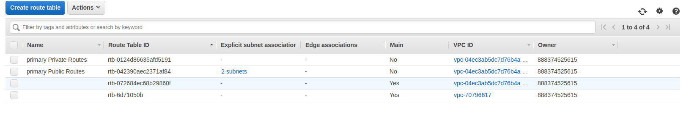

In this project you will create highly available solutions to common use cases. You will build a Multi-AvailabilityZone, Multi-Region database and show how to use it in multiple geographically separate AWS regions. You will also build a website hosting solution that is versioned so that any data destruction and accidents can be quickly and easily undone.
#
# Part 1  Data Durability And Recovery

## two AWS regions. An active region and a standby region.

## Highly durable RDS Database
primaryDB

secondaryDB

primary subnet

secondary subnet

subnets

routing table

## Availability Estimate

## Demonstrate normal usage

## Monitor database

## Failover And Recovery

#
# Part 2 Website Resiliency
Build a resilient static web hosting solution in AWS. Create a versioned S3 bucket and configure it as a static website.

You will now “accidentally” change the contents of the website such that it is no longer serving the correct content

You will now need to “recover” the website by rolling the content back to a previous version.

You will now “accidentally” delete contents from the S3 bucket

You will now need to “recover” the objec

